# **Tugas 3 - Secure Coding Implementation**

**Kelompok : kelompok kami suka panen sawit**  
Anggota Kelompok:

- Nezzaluna Azzahra (2406495741)
- Hillary Elizabeth Clara Pasaribu (2406407266)
- Cristian Dillon Philbert (2406495956)
- Raihana Auni Zakia (2406495760)
- Vidia Qonita Ahmad (2406345381)

---

## 1. Deskripsi Aplikasi

### A. Skenario & Fitur Utama

- **Skenario:** Ride-Hailing Platform

  Aplikasi ini mensimulasikan platform transportasi berbasis ride-hailing (ojek online) yang menghubungkan tiga jenis pengguna dengan alur interaksi sebagai berikut:

  | Aktor            | Aksi                             | Hasil                                             |
  | ---------------- | -------------------------------- | ------------------------------------------------- |
  | Penumpang        | Registrasi & login ke sistem     | Mendapatkan akses dashboard penumpang             |
  | Penumpang        | Mengisi titik jemput & tujuan    | Pesanan dibuat dengan status `Menunggu Pengemudi` |
  | Pengemudi        | Login & melihat pesanan masuk    | Daftar pesanan yang tersedia ditampilkan          |
  | Pengemudi        | Mengambil pesanan                | Status berubah menjadi `Sedang Diantar`           |
  | Pengemudi        | Menyelesaikan pesanan            | Status berubah menjadi `Selesai`                  |
  | Penumpang        | Memberikan rating & ulasan       | Skor bintang (1–5) dan teks ulasan tersimpan      |
  | Penyedia Layanan | Login & membuka panel monitoring | Seluruh transaksi dan performa driver terpantau   |

- **Fitur yang Diimplementasikan:**

  | #   | Fitur                             | Role                  | Deskripsi                                                                                                                                                |
  | --- | --------------------------------- | --------------------- | -------------------------------------------------------------------------------------------------------------------------------------------------------- |
  | 1   | **Pemesanan Ojek** (Request Ride) | Penumpang             | Penumpang mengisi titik jemput dan titik tujuan. Pesanan masuk ke antrian dengan status `Menunggu Pengemudi`.                                            |
  | 2   | **Ambil & Selesaikan Pesanan**    | Pengemudi             | Pengemudi melihat pesanan masuk, mengambil pesanan (status → `Sedang Diantar`), lalu menyelesaikannya (status → `Selesai`).                              |
  | 3   | **Riwayat Perjalanan**            | Penumpang & Pengemudi | Menampilkan seluruh histori pesanan dengan fitur pencarian berdasarkan titik jemput/tujuan.                                                              |
  | 4   | **Rating & Ulasan Driver**        | Penumpang             | Penumpang memberi skor bintang (1–5) dan ulasan teks untuk pesanan yang sudah selesai. Setiap pesanan hanya dapat dirating satu kali.                    |
  | 5   | **Dashboard Pengemudi**           | Pengemudi             | Menampilkan ringkasan: jumlah antar hari ini, pesanan masuk terkini, rata-rata rating, dan ulasan terbaru.                                               |
  | 6   | **Panel Monitoring**              | Penyedia Layanan      | Memantau seluruh transaksi platform secara real-time: total pesanan, menunggu, selesai, dan dibatalkan.                                                  |
  | 7   | **Rating & Review Platform**      | Penyedia Layanan      | Melihat performa tiap pengemudi (avg rating, jumlah review, total antar) serta semua ulasan yang masuk.                                                  |
  | 8   | **Autentikasi & Registrasi**      | Semua Role            | Registrasi akun dengan pemilihan role, login dengan rate limiting (kunci akun setelah 5 kali gagal), dan logout yang menginvalidasi session server-side. |

- **Master Data & Role User:**
  1. **Penumpang (Passenger)**: Membuat pesanan, melihat riwayat perjalanan, memberikan rating dan ulasan untuk pengemudi.
  2. **Pengemudi (Driver)**: Melihat pesanan masuk, mengambil pesanan, menyelesaikan perjalanan, dan memantau rating yang diterima.
  3. **Penyedia Layanan (Admin)**: Memantau seluruh transaksi platform dan mereview performa serta ulasan semua pengemudi.

**Tampilan Aplikasi:**

| Halaman         | Role      | Screenshot                                                          |
| --------------- | --------- | ------------------------------------------------------------------- |
| Login           | Semua     | 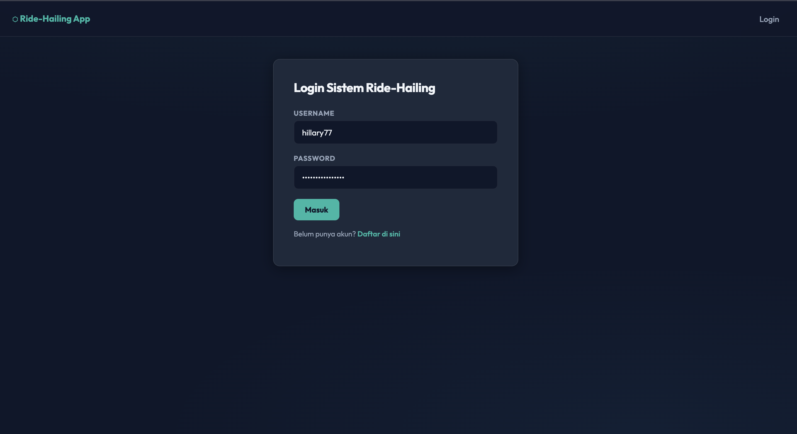                              |
| Registrasi      | Semua     | 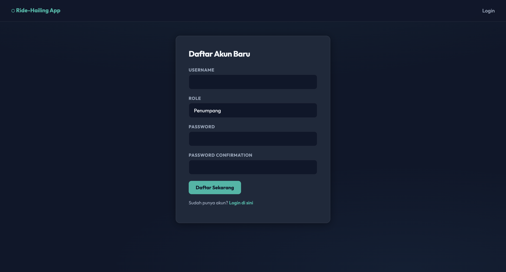                      |
| Dashboard       | Penumpang | 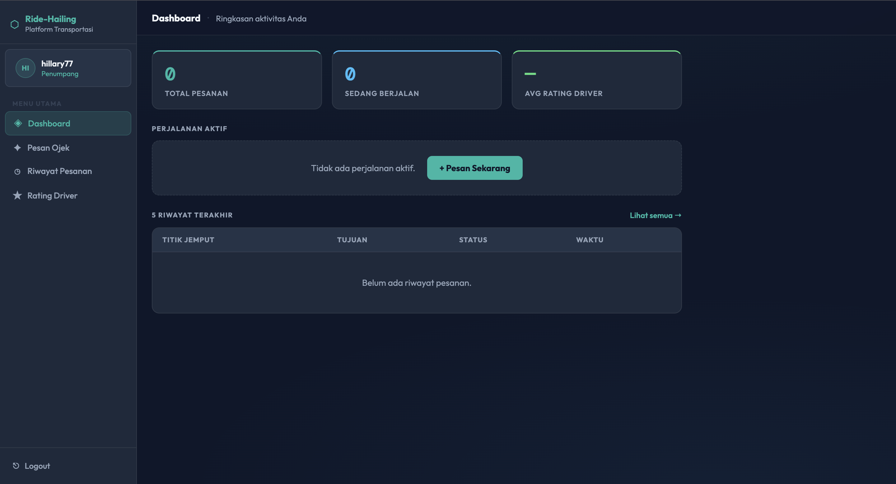  |
| Dashboard       | Pengemudi | 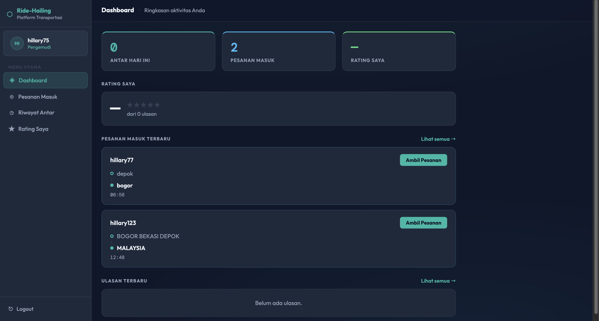  |
| Dashboard       | Penyedia  | 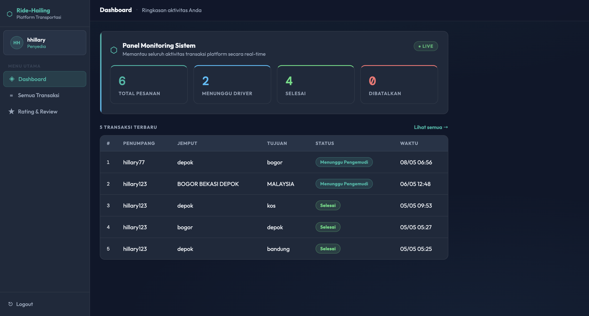    |
| Buat Pesanan    | Penumpang | 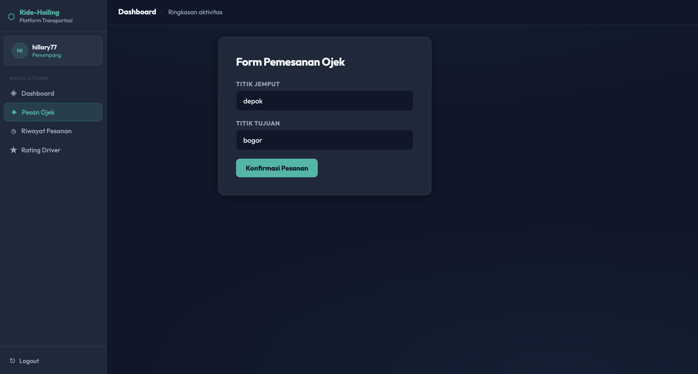                |
| Pesanan Masuk   | Pengemudi | 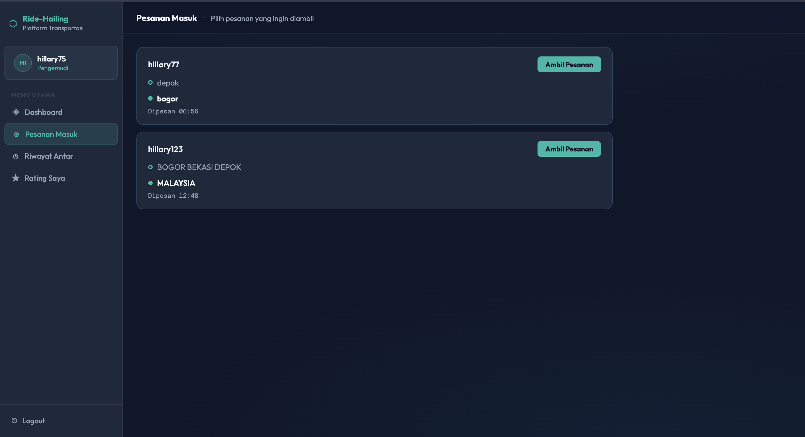              |
| Riwayat Pesanan | Penumpang | 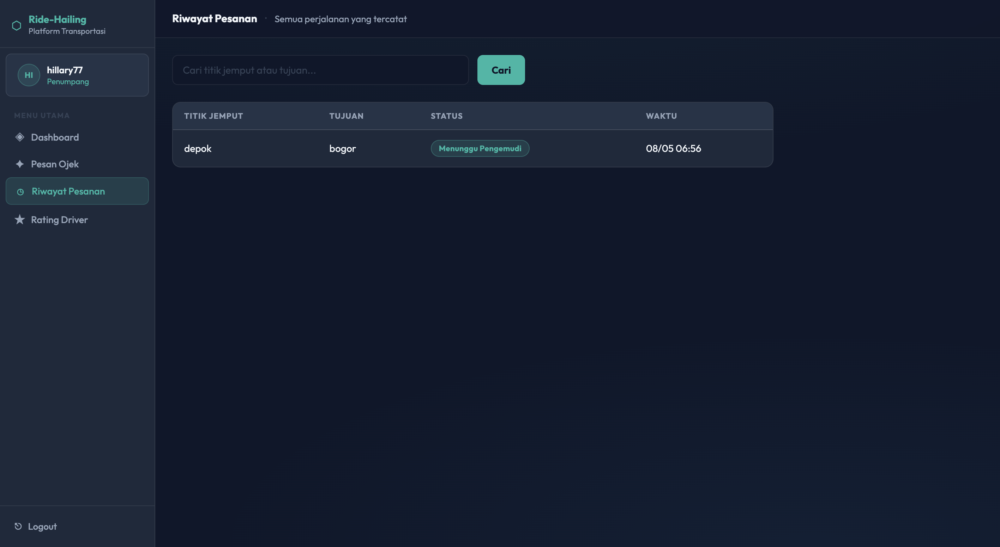            |
| Riwayat Antar   | Pengemudi | 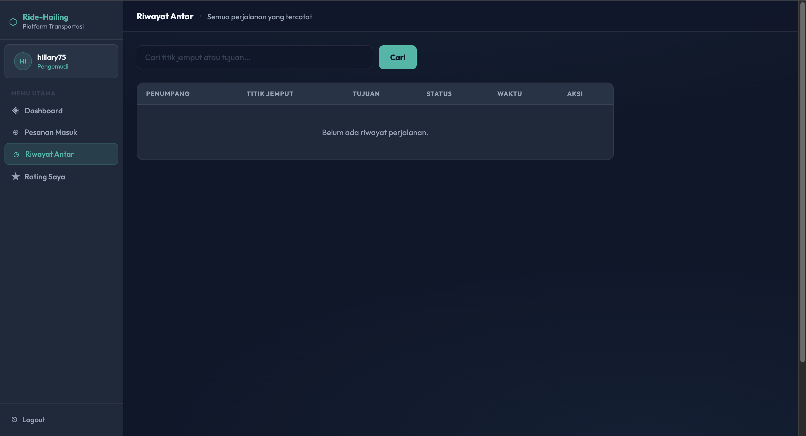              |
| Rating Driver   | Penumpang | 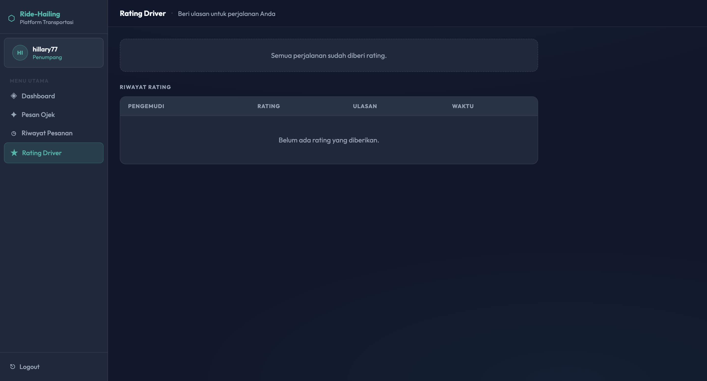              |
| Rating Saya     | Pengemudi | 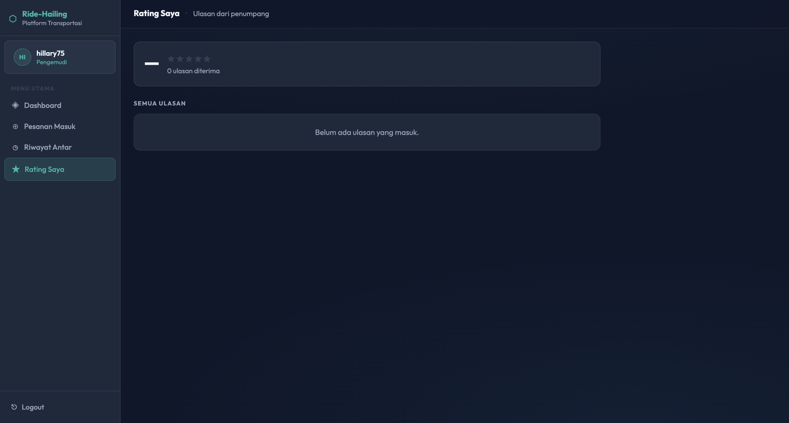                  |
| Semua Transaksi | Penyedia  | 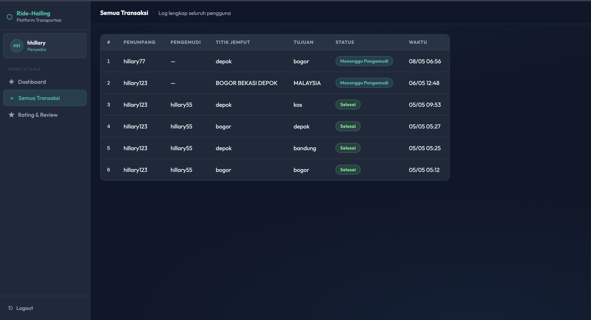 |
| Rating & Review | Penyedia  | 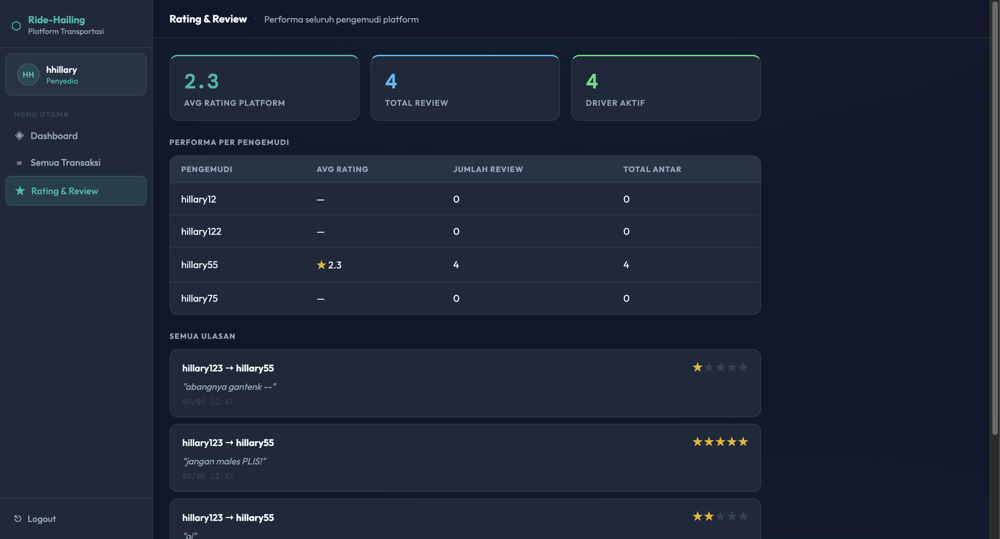          |

### B. Stack Teknologi

- **Framework:** Django 4.x (Python)
- **Database:** SQLite (development) — dengan adapter `psycopg2-binary` untuk migrasi ke PostgreSQL
- **Template Engine:** Django Template Language (DTL)
- **Autentikasi:** Django built-in `AbstractUser` dengan custom field `role`, session-based authentication
- **Library Lain:**

  | Library                | Kegunaan                                                     |
  | ---------------------- | ------------------------------------------------------------ |
  | `gunicorn`             | WSGI HTTP Server untuk production deployment                 |
  | `whitenoise`           | Serving static files di production tanpa web server tambahan |
  | `psycopg2-binary`      | PostgreSQL adapter untuk future database migration           |
  | `python-dotenv`        | Manajemen environment variable dari file `.env`              |
  | `requests` / `urllib3` | HTTP client library untuk request eksternal                  |

- **Keamanan (Security Layer):**
  - `CsrfViewMiddleware` — proteksi CSRF pada semua form POST
  - `django.core.cache` — rate limiting login attempt
  - Custom `sanitizers.py` — allowlist validation & HTML entity escaping untuk input pengguna
  - `@login_required` decorator — proteksi seluruh endpoint sensitif
  - Role-based access control (RBAC) manual di setiap view

---

## 2. Implementasi Secure Coding

### A. Code Injection

- **Vulnerability:**
  - Input pengguna pada field pesanan dan review dapat digunakan untuk injeksi HTML, XSS, atau template injection jika ditampilkan kembali tanpa pengamanan.
  - Risiko yang dimitigasi:
    - **CWE-79**: Improper Neutralization of Input During Web Page Generation (Cross-Site Scripting)
    - **CWE-94**: Improper Control of Generation of Code ('Code Injection')

- **Teknik Mitigasi:**
  - Django template auto-escaping tetap aktif secara global sehingga output dari `{{ }}` tidak dirender sebagai HTML/script.
  - Tidak ada penggunaan `|safe` atau `mark_safe()` pada konten pengguna.
  - Input divalidasi dengan allowlist karakter sebelum diproses atau disimpan ke database. Namun, untuk menunjang _UX_ yang lebih _seamless_ dan mempraktikkan _defense-in-depth_, karakter spesial (`<, >, ", ', {}`) tetap diizinkan dinput dari _frontend_, lalu dinetralisir perambatannya dengan fungsi escape HTML dan pengubahan sintaks _template marker_ di backend.
  - Model dan form melakukan validasi terpusat untuk _field_ yang berisiko (`titik_jemput`, `titik_tujuan`, `ulasan`, dan `username`).

- **Perbandingan Kode:**

  | Bagian              | Sebelum (Vulnerable)                                                                 | Sesudah (Secure)                                                                                                     | Penjelasan                                                                                                                                        | File                                                                                                                                                           |
  | :------------------ | :----------------------------------------------------------------------------------- | :------------------------------------------------------------------------------------------------------------------- | :------------------------------------------------------------------------------------------------------------------------------------------------ | :------------------------------------------------------------------------------------------------------------------------------------------------------------- |
  | Input pesanan       | `request.POST.get('titik_jemput')` langsung dipakai ke `Pesanan.objects.create(...)` | `clean_titik_jemput()` memanggil `validate_no_injection()`, `validate_location_allowlist()`, lalu `sanitize_input()` | Mencegah HTML/skrip masuk ke data pesanan sebelum disimpan dengan menjadikannya karakter yang aman (HTML Entity escaped)                          | [main/forms.py](main/forms.py), [main/models.py](main/models.py)                                                                                               |
  | Input review        | `request.POST.get('ulasan')` langsung disimpan ke `Rating.objects.create(...)`       | `clean_ulasan()` memvalidasi allowlist lalu men-sanitize teks review melalui escape yang ketat                       | Menutup stored XSS dan HTML injection pada field ulasan sambil menjaga visibilitas input secara literatur.                                        | [main/forms.py](main/forms.py), [main/models.py](main/models.py)                                                                                               |
  | Template output     | `{{ rating.ulasan\|safe }}` dapat memaksa HTML dirender                              | `{{ rating.ulasan }}` dibiarkan memakai auto-escaping Django                                                         | Output pengguna tetap tampil sebagai teks, bukan HTML/script                                                                                      | [main/templates/main/rating_review.html](main/templates/main/rating_review.html), [main/templates/main/rating_saya.html](main/templates/main/rating_saya.html) |
  | Validasi username   | Username dapat masuk tanpa allowlist yang ketat                                      | `clean_username()` memanggil `validate_username_allowlist()`                                                         | Mengurangi risiko payload injeksi pada identitas akun                                                                                             | [main/forms.py](main/forms.py), [main/models.py](main/models.py)                                                                                               |
  | Validasi & sanitasi | Tidak ada module khusus untuk validasi/sanitasi input                                | Module `sanitizers.py` dengan fungsi mitigasi injeksi dan allowlist yang lebih luwes                                 | Menyediakan fungsi reusable untuk membersihkan/meng-escape pattern injeksi (script, event handler, template) secara "silent" pada output/database | [main/sanitizers.py](main/sanitizers.py)                                                                                                                       |

### B. Broken Authentication

- **Vulnerability:**  
  Tanpa implementasi autentikasi yang aman, penyerang dapat melakukan berbagai serangan seperti mencuri kredensial dari database (password plaintext), brute force login tanpa batas, menggunakan session lama setelah logout, atau mengakses halaman terproteksi langsung via URL.
  - **CWE-256**: Penyimpanan password dalam bentuk plaintext
  - **CWE-307**: Tidak ada pembatasan percobaan login (Brute Force)
  - **CWE-613**: Session tidak diinvalidasi setelah logout
  - **CWE-306**: Akses halaman terproteksi tanpa autentikasi
  - **CWE-204**: Pesan error yang membocorkan informasi (username vs password)

- **Teknik Mitigasi:**
  - Password di-hash otomatis menggunakan PBKDF2-SHA256 dengan 1.000.000 iterasi melalui `UserCreationForm` bawaan Django — password tidak pernah tersimpan plaintext di database.
  - Rate limiting menggunakan Django cache: akun dikunci sementara selama 5 menit setelah 5 kali percobaan login gagal.
  - Session dihapus dari sisi server menggunakan `logout()` bawaan Django, dikombinasikan dengan `SESSION_COOKIE_HTTPONLY = True` dan `SESSION_COOKIE_SAMESITE = 'Strict'`.
  - Seluruh view sensitif dilindungi dengan decorator `@login_required`, sehingga akses langsung via URL tanpa session aktif otomatis di-redirect ke halaman login.
  - Pesan error login menggunakan teks yang identik untuk semua kasus gagal melalui `authenticate()` Django, sehingga attacker tidak dapat membedakan apakah username terdaftar atau tidak.
  - Prinsip least privilege diterapkan per role: setiap role hanya dapat mengakses endpoint yang sesuai haknya, akses tidak sah di-redirect ke dashboard.

- **Perbandingan Kode:**

  | Sebelum (Vulnerable)                                                                                 | Sesudah (Secure)                                                                                                       | File            |
  | :--------------------------------------------------------------------------------------------------- | :--------------------------------------------------------------------------------------------------------------------- | :-------------- |
  | `user.password = request.POST['password']`<br>`user.save()`                                          | `class RegisterForm(UserCreationForm):`<br>`    # set_password() dipanggil otomatis`                                   | `main/forms.py` |
  | `def login_view(request):`<br>`    user = authenticate(...)`<br>`    # tidak ada pembatasan attempt` | `attempts = cache.get(cache_key, 0)`<br>`if attempts >= 5:`<br>`    # blokir request`                                  | `main/views.py` |
  | `def logout_view(request):`<br>`    response.delete_cookie('sessionid')`<br>`    return response`    | `def logout_view(request):`<br>`    logout(request)  # hapus session di server`<br>`    return redirect('main:login')` | `main/views.py` |
  | `def dashboard(request):`<br>`    # bisa diakses tanpa login`                                        | `@login_required(login_url='/login/')`<br>`def dashboard(request):`                                                    | `main/views.py` |
  | `messages.error(request, "Username tidak ditemukan.")`                                               | `messages.error(request, "Username atau password salah.")`                                                             | `main/views.py` |
  | `def pesanan_masuk(request):`<br>`    # semua role bisa akses`                                       | `if request.user.role != 'pengemudi':`<br>`    return redirect('main:dashboard')`                                      | `main/views.py` |

  **Penjelasan:**  
  Django menyimpan password dalam format `pbkdf2_sha256$1000000$<salt>$<hash>` sehingga tidak dapat dibaca langsung dari database. Rate limiting menggunakan cache mencegah brute force dengan mengunci akun setelah 5 kali gagal (timeout 300 detik). Fungsi `logout()` menghapus session dari server-side store, bukan hanya cookie client, sehingga token lama tidak dapat digunakan kembali. Decorator `@login_required` memastikan semua endpoint sensitif mengembalikan redirect HTTP 302 jika tidak ada session valid. Pengecekan role di setiap view memastikan prinsip least privilege terpenuhi.

### C. CSRF (Cross-Site Request Forgery)

- **Vulnerability:**  
  Tanpa perlindungan CSRF, penyerang dapat memaksa pengguna yang sudah login untuk mengirimkan request berbahaya (misalnya memesan ojek, mengirim rating, atau mengubah data) melalui situs eksternal atau email.  
  **CWE-352: Cross-Site Request Forgery (CSRF)**

- **Teknik Mitigasi:**
  - Semua form dengan metode `POST` (login, register, pesan ojek, rating) wajib menyertakan token CSRF menggunakan `` di template.
  - Middleware `CsrfViewMiddleware` tetap aktif (default Django) untuk memverifikasi setiap request POST/PUT/DELETE.
  - Tidak ada satupun view yang diberi dekorator `@csrf_exempt`.
  - Untuk request AJAX, token diambil dari cookie `csrftoken` dan dikirim melalui header `X-CSRFToken`.
  - Konfigurasi CORS dibiarkan default sehingga request dari origin `null` (file lokal) atau domain tidak dikenal ditolak.

- **Perbandingan Kode:**

  | Sebelum (Vulnerable)                                 | Sesudah (Secure)                                              | File                                              |
  | :--------------------------------------------------- | :------------------------------------------------------------ | :------------------------------------------------ |
  | `<form method="POST" action="/pesan/">` tanpa token  | `<form method="POST" action="/pesan/">` + ``  | `main/templates/main/buat_pesanan.html`           |
  | `<form method="POST" action="/rating/">` tanpa token | `<form method="POST" action="/rating/">` + `` | `main/templates/main/beri_rating.html`            |
  | Tidak ada token di form login/register               | Login & register juga menggunakan ``          | `main/templates/main/login.html`, `register.html` |

  **Penjelasan:**  
  Django menghasilkan token unik per session yang disisipkan sebagai hidden input. Middleware `CsrfViewMiddleware` memverifikasi kecocokan token sebelum memproses request. Jika token tidak ada, salah, atau tidak dikirim, server mengembalikan **HTTP 403 Forbidden**.

### D. SQL/Database Injection

- **Vulnerability:**
  - Input pengguna pada fitur autentikasi dan kotak pencarian riwayat dapat dieksekusi sebagai perintah SQL aktif jika digabungkan secara langsung menggunakan raw string concatenation, memungkinkan penyerang melewati autentikasi atau mengekstrak data dari tabel lain.
  - Risiko yang dimitigasi:
    - **CWE-89**: Improper Neutralization of Special Elements used in an SQL Command

- **Teknik Mitigasi:**
  - Seluruh interaksi database pada endpoint login sama sekali tidak menggunakan eksekusi string SQL mentah, melainkan menggunakan fungsi autentikasi bawaan Django yang secara otomatis menjalankan parameterized query.
  - Seluruh query pada fitur filter dan pencarian riwayat dikelola menggunakan `Model.objects.filter()` untuk menjamin binding parameter sehingga input terpisah secara ketat dari perintah eksekusi SQL.
  - Input pencarian divalidasi dengan allowlist karakter menggunakan Regular Expression sebelum diproses ke dalam query ORM.
  - Prinsip least privilege diimplementasikan pada File Permissions untuk membatasi akses baca/tulis terhadap file `db.sqlite3` hanya kepada service account web server yang membutuhkan.

- **Perbandingan Kode:**

  | Bagian              | Sebelum (Vulnerable)                                                                                                     | Sesudah (Secure)                                                                                                                             | Penjelasan                                                                                                                  | File            |
  | :------------------ | :----------------------------------------------------------------------------------------------------------------------- | :------------------------------------------------------------------------------------------------------------------------------------------- | :-------------------------------------------------------------------------------------------------------------------------- | :-------------- |
  | Autentikasi Login   | Input `username` dan `password` dirangkai paksa menggunakan f-string ke dalam eksekusi `cursor.execute()`.               | Mendelegasikan validasi ke fungsi `authenticate()` bawaan Django yang otomatis menerapkan parameterized query.                               | Mencegah Login Bypass seperti `' OR '1'='1` karena input berbahaya akan dikunci sebagai nilai literal biasa.                | `main/views.py` |
  | Pencarian Riwayat   | Parameter `q` langsung disisipkan ke dalam raw query menggunakan perintah eksekusi `LIKE '%{search_query}%'`.            | Parameter diuji menggunakan validasi regex allowlist, kemudian dieksekusi murni melalui fungsionalitas Django ORM `.filter()` dan objek `Q`. | Menutup celah eksploitasi Data Extraction secara berlapis dengan blokir karakter di backend dan perlindungan parameter ORM. | `main/views.py` |
  | Izin Akses Database | Konfigurasi database tidak dikunci, file `db.sqlite3` dapat diakses dan dibaca oleh pengguna sistem operasi secara luas. | Akses read/write pada sistem operasi dibatasi secara ketat khusus untuk eksekutor aplikasi.                                                  | Memenuhi prinsip Least Privilege untuk skenario file-based database tanpa user management internal DBMS.                    | Server Config   |

---

## 3. Hasil Test-Case

### A. Code Injection Test Cases

- **TC-CI-01** (Script Tag Injection): [Status PASS] Payload `<script>alert('XSS')</script>` berhasil ditangani dengan baik. Input yang berisi tag script tidak dieksekusi melainkan di-escape menjadi entitas HTML (`&lt;script&gt;...&lt;/script&gt;`) sehingga ditampilkan sebagai teks biasa kepada pengguna. Tidak ada JavaScript yang berjalan di browser.
  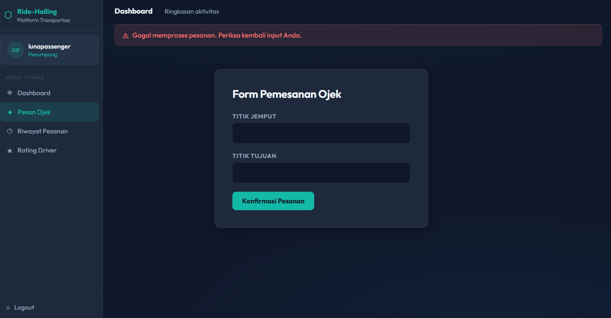

- **TC-CI-02** (HTML Injection): [Status PASS] Payload berbahaya seperti `<h1>Hacked</h1>` berhasil dineutralisir. Seluruh tag HTML dan event handler yang berpotensial merusak di-escape sehingga hanya tampil sebagai teks literal tanpa merender elemen HTML atau menjalankan handler event apapun.
  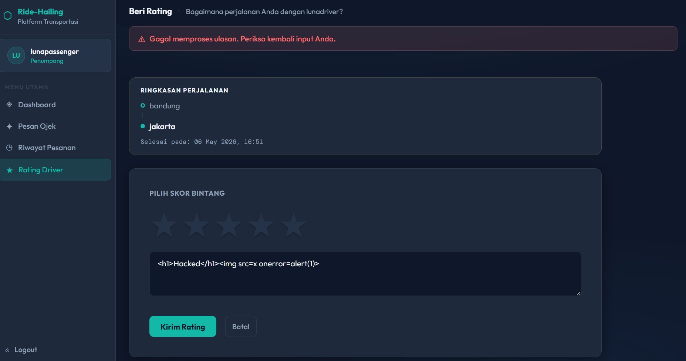

- **TC-CI-03** (Template Expression Injection): [Status PASS] Payload template seperti `{{7*7}}` dan `{{config.SECRET_KEY}}` berhasil disanitasi tanpa mengakses variabel server. Template marker di-escape menjadi HTML entity sehingga tidak dievaluasi oleh template engine, melainkan ditampilkan kepada user sebagai string literal yang aman.
  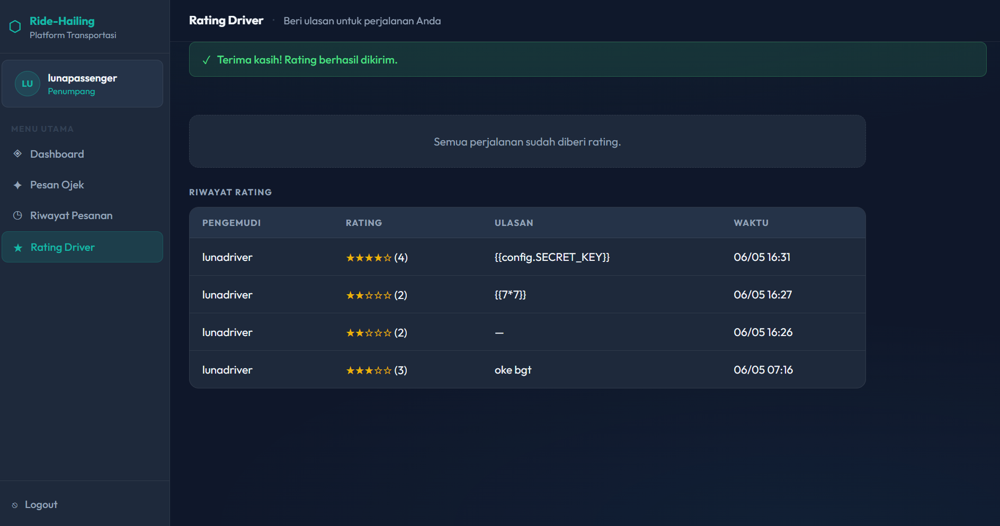

- **TC-CI-04g** (Ride Hailing: Review/Rating dengan Payload Injeksi): [Status PASS] Input field `ulasan` (review) pada fitur rating pesanan successfully menangani payload injection. User dapat menginput karakter spesial seperti `<`, `>`, `{}`, `%` tanpa error di depan, namun ketika ditampilkan kembali di halaman review rating, semua payload berbahaya di-escape sehingga tidak ada potensi XSS atau template injection.
  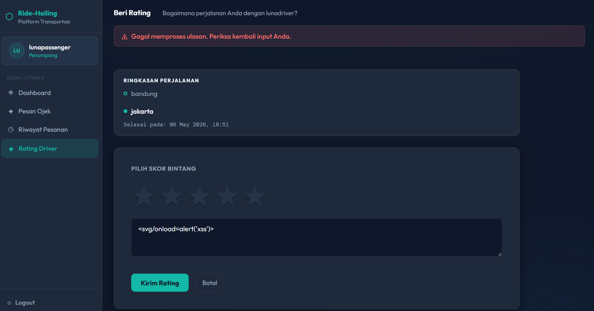

### B. Broken Authentication Test Cases

- **TC-BA-01** (Password Hashing): [Status PASS] Password pengguna tidak disimpan dalam bentuk plaintext di database. Setelah registrasi akun baru dengan password "TestPassword123", query langsung ke database SQLite menunjukkan password tersimpan dalam format hash `pbkdf2_sha256$1000000$...`. Django menggunakan algoritma PBKDF2-SHA256 dengan 1.000.000 iterasi salt melalui `UserCreationForm`, sehingga password asli tidak dapat dibaca langsung dari database.
  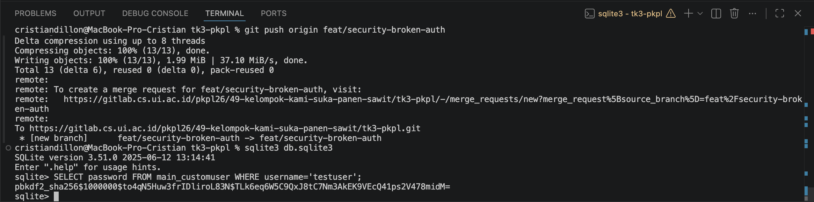

- **TC-BA-02** (Rate Limiting / Brute Force Protection): [Status PASS] Sistem memblokir percobaan login setelah 5 kali gagal berturut-turut. Pada percobaan keenam, akun dikunci sementara selama 5 menit dan menampilkan pesan "Akun dikunci sementara. Coba lagi dalam 5 menit." Implementasi menggunakan Django cache untuk melacak jumlah percobaan gagal per username dengan timeout 300 detik.
  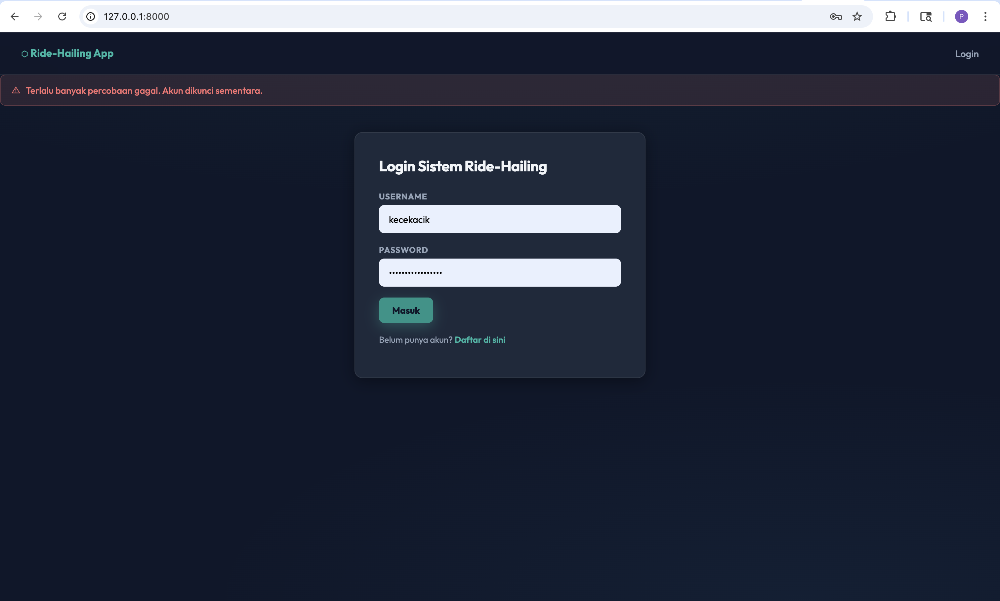

- **TC-BA-03** (Session Invalidation setelah Logout): [Status PASS] Session token dihapus dari sisi server saat pengguna logout. Setelah logout, percobaan mengakses `/dashboard/` langsung via URL langsung di-redirect ke halaman login. Fungsi `logout()` bawaan Django menghapus session dari server-side store, bukan hanya menghapus cookie di sisi client, sehingga token lama tidak dapat digunakan kembali.
  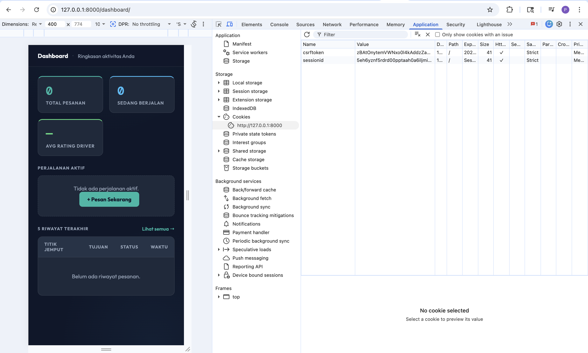
  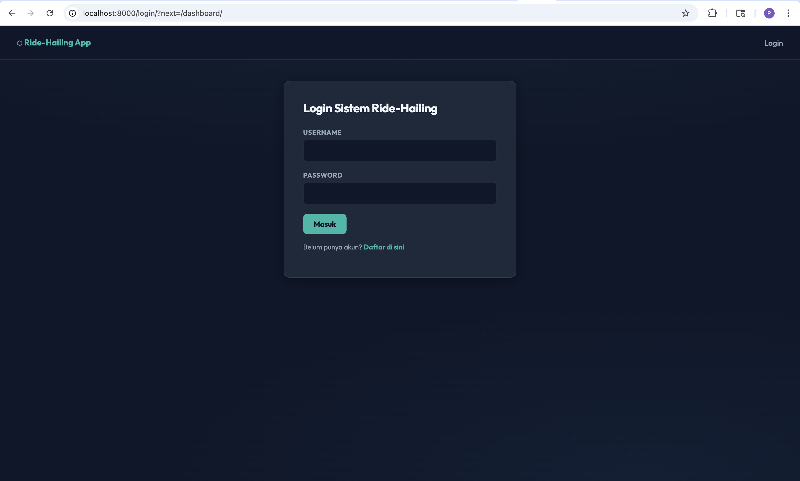

- **TC-BA-04** (Proteksi Halaman Tanpa Login): [Status PASS] Seluruh endpoint sensitif tidak dapat diakses tanpa session aktif. Percobaan mengakses `/dashboard/`, `/my-orders/`, dan `/pesanan-masuk/` langsung via URL tanpa login menghasilkan redirect otomatis ke halaman login (HTTP 302). Semua view sensitif dilindungi dengan decorator `@login_required(login_url='/login/')`.
  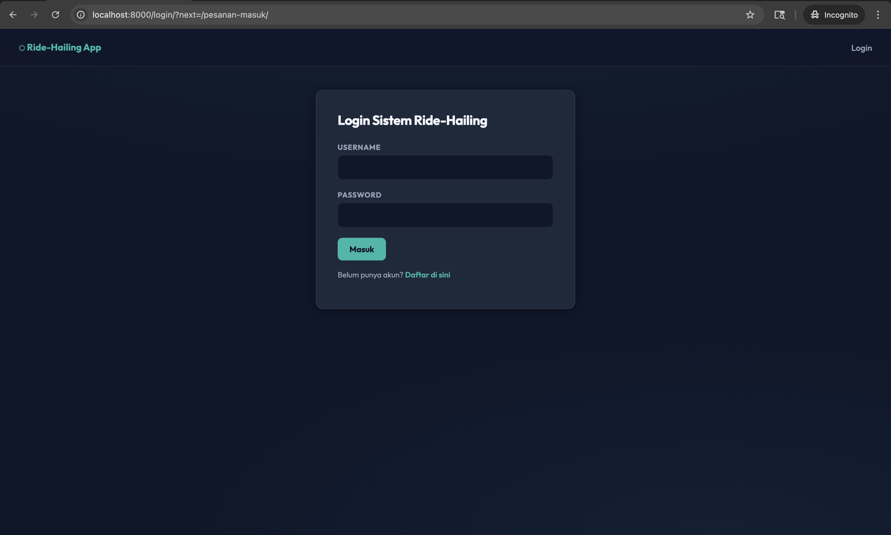

- **TC-BA-05** (Generic Error Message): [Status PASS] Pesan error login tidak membocorkan informasi apakah username atau password yang salah. Percobaan login dengan username tidak terdaftar maupun username valid dengan password salah menghasilkan pesan yang identik: "Username atau password salah." Implementasi menggunakan fungsi `authenticate()` bawaan Django yang menggabungkan pengecekan username dan password dalam satu fungsi tanpa membedakan jenis kegagalan.
  
  

### C. CSRF Test Cases

- **TC-CSRF-01** (CSRF Token Presence on Forms): [Status PASS] Seluruh form POST di aplikasi (login, register, pesan ojek, rating) telah dilengkapi dengan CSRF token sebagai hidden input. Inspeksi HTML source form menunjukkan kehadiran `<input type="hidden" name="csrfmiddlewaretoken" value="...">` pada setiap form write operation. Middleware `CsrfViewMiddleware` Django secara default melakukan validasi token pada setiap request POST.
  
  
  

- **TC-CSRF-02** (Request dengan CSRF Token Invalid Ditolak): [Status PASS] Saat CSRF token diubah menjadi nilai palsu (misal: `invalid_token_12345`), server menolak request dengan merespons **HTTP 403 Forbidden**. Operasi write (pemesanan, rating, update data) tidak dieksekusi. Middleware CSRF Django secara ketat memvalidasi kecocokan token sebelum memproses POST request.
  

- **TC-CSRF-03** (Simulasi Cross-Origin Request Tanpa Token): [Status PASS] File `csrf_attack.html` yang berisi form POST ke endpoint aplikasi dari origin lokal (`file://`) ditolak dengan HTTP 403. Browser dan server menganggap request ini sebagai cross-origin tanpa CSRF token yang valid. Konfigurasi CORS default Django menolak request dari origin yang tidak sesuai.
  
  

- **TC-CSRF-04g** (Ride Hailing: Form Pemesanan Ojek dengan CSRF Protection): [Status PASS] Endpoint POST `/pesan/` (pemesanan ojek) dilindungi CSRF token. Percobaan membuat pesanan atas nama pengguna lain dari halaman eksternal gagal karena token tidak valid. Aplikasi hanya memproses request yang disertai CSRF token yang sesuai dengan session pengguna yang sedang login.
  

### D. SQL Injection Test Cases

- **TC-SQLi-01** (Login Bypass via SQL Injection): [Status PASS] Sistem berhasil menolak payload serangan dan meresponsnya secara normal dengan pesan error bahwa kredensial salah. Fungsi authenticate bawaan terbukti efektif mengamankan endpoint dari upaya login bypass secara paksa.
  
  

- **TC-SQLi-02** (Data Extraction via Search Input): [Status PASS] Upaya penyisipan payload UNION SELECT berhasil digagalkan oleh regex dan ORM. Aplikasi tetap mengembalikan hasil pencarian secara normal atau kosong tanpa membocorkan isi data dari tabel users serta tidak menampilkan stack trace sama sekali.
  
  

- **TC-SQLi-03** (Parameterized Query Verification): [Status PASS] Hasil code review memverifikasi bahwa tidak ada satu pun raw string concatenation yang berasal dari input user. Seluruh fungsi telah sepenuhnya diimplementasikan menggunakan Django ORM dan parameterized query untuk menjamin keamanan.
  

- **TC-SQLi-04g** (Ride Hailing: Pencarian Riwayat Perjalanan): [Status PASS] Payload manipulasi logika seperti `5 OR 1=1` berhasil ditangani dengan baik. Aplikasi tetap mengisolasi data secara ketat dengan hanya menampilkan riwayat pesanan milik user yang sedang login sehingga sukses mencegah kebocoran privasi data milik user lain.
  
  

---

## 4. Petunjuk Instalasi

```bash
# 1. Clone Repositori
git clone https://gitlab.cs.ui.ac.id/pkpl26/49-kelompok-kami-suka-panen-sawit/tk3-pkpl.git

# 2. Setup Environment
python -m venv venv
source venv/bin/activate  # Unix/macOS
venv\Scripts\activate     # Windows

# 3. Install Dependencies
pip install -r requirements.txt

# 4. Database Migration
python manage.py migrate

# 5. Implementasi Least Privilege
chmod 600 db.sqlite3

# 6. Jalankan Aplikasi
python manage.py runserver
```

## 5. Video Youtube Demo - TK 3

### **[Video Kelompok](https://youtu.be/HIQAN5IEPww)**

---

# **Tugas 4 - Laporan Unit Testing & Pentesting**

**Kelompok : kelompok kami suka panen sawit**  
Anggota Kelompok:

- Nezzaluna Azzahra (2406495741)
- Hillary Elizabeth Clara Pasaribu (2406407266)
- Cristian Dillon Philbert (2406495956)
- Raihana Auni Zakia (2406495760)
- Vidia Qonita Ahmad (2406345381)

## A. Laporan Unit Testing

### 1. Code Injection Prevention

**Tujuan Pengujian:** Memverifikasi bahwa mekanisme pencegahan Code Injection (HTML Injection, XSS, dan Template Injection) pada aplikasi Ride-Hailing telah berfungsi dengan baik.

**Skenario & Hasil Pengujian (`tests/test_code_injection.py`):**
| Nama Test Case | Deskripsi Pengujian | Hasil Uji (Pass/Fail) | Penjelasan |
|----------------|---------------------|-----------------------|------------|
| `test_sanitize_input_html_escape` | Menguji apakah input yang mengandung tag HTML dan script `<script>alert(1)</script>` berhasil di-escape. | **PASS** | Input diubah menjadi entitas HTML `&lt;script&gt;alert(1)&lt;/script&gt;`. |
| `test_sanitize_input_template_injection` | Menguji pencegahan injeksi ekspresi template Django (`{{ 7*7 }}` dan ``). | **PASS** | Karakter `{` dan `}` di-escape dengan benar. |
| `test_validate_location_allowlist_valid` | Menguji input lokasi yang valid sesuai dengan regex allowlist. | **PASS** | Input `"Jl. Merdeka No. 1, Jakarta"` diterima tanpa memicu ValidationError. |
| `test_validate_location_allowlist_invalid` | Menguji input lokasi yang mengandung karakter berbahaya (`whoami`). | **PASS** | Sistem menolak input dan melempar `ValidationError`. |
| `test_validate_review_allowlist_valid` | Menguji input teks review/ulasan valid. | **PASS** | Input ulasan biasa berhasil lolos validasi allowlist. |
| `test_validate_review_allowlist_invalid` | Menguji penolakan karakter berbahaya (misalnya `$`, backtick) pada input review. | **PASS** | Input ditolak dan melempar `ValidationError`. |
| `test_validate_username_allowlist_invalid` | Menguji input username yang mengandung XSS payload (`admin<script>`). | **PASS** | Sistem menolak input karena `<` dan `>` dilarang pada username. |
| `test_pesanan_model_xss_sanitization` | Menguji penerapan sanitasi pada field `titik_jemput` & `titik_tujuan` di Model Pesanan. | **PASS** | HTML otomatis disanitasi dan di-escape di database. |
| `test_rating_model_xss_sanitization` | Menguji penerapan sanitasi pada field `ulasan` di model Rating. | **PASS** | Payload injeksi disanitasi sebelum rating disimpan. |

**Kesimpulan:** Semua modul sanitasi, validasi, dan proteksi XSS/Code Injection pada aplikasi berhasil lolos pengujian (_Passed_).

**Bukti Lolos Uji:**
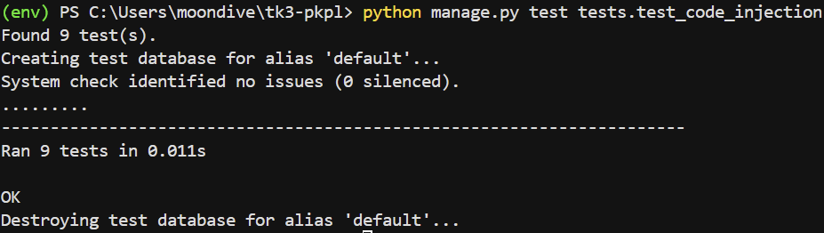

### 2. Broken Authentication Mitigation

**Tujuan Pengujian:** ...
**Skenario & Hasil Pengujian:** ...
**Kesimpulan:** ...

### 3. CSRF Protection

- **Tujuan Pengujian:** Memastikan seluruh form dan endpoint yang menggunakan metode POST telah dilindungi oleh mekanisme CSRF Django, sehingga request yang tidak membawa token valid tidak dapat diproses oleh server.

- **Metodologi & Skenario:** Pengujian dilakukan menggunakan `django.test.Client` dengan parameter `enforce_csrf_checks=True` agar validasi CSRF benar-benar dijalankan selama unit testing. Skenario yang diuji meliputi:
  1. Memastikan `CsrfViewMiddleware` aktif di konfigurasi `MIDDLEWARE`.
  2. Memastikan tidak ada penggunaan `@csrf_exempt` pada `main/views.py`.
  3. Memastikan form login, register, dan pesan ojek memuat input `csrfmiddlewaretoken`.
  4. Memastikan request POST ke login, register, dan pesan ojek tanpa CSRF token ditolak dengan HTTP 403 Forbidden.
  5. Memastikan request POST dengan CSRF token valid tidak ditolak oleh validasi CSRF.

- **Ekspektasi Hasil:** Seluruh form POST harus memuat CSRF token. Request POST tanpa token harus ditolak dengan status 403 Forbidden, sedangkan request dengan token valid tidak boleh ditolak karena alasan CSRF.

- **Hasil Aktual & Analisis:** [Status PASS] Pengujian berhasil dijalankan bersama test lain dengan hasil `Ran 13 tests ... OK`. Middleware CSRF aktif, tidak ditemukan penggunaan `@csrf_exempt`, dan form penting telah menyertakan token CSRF. Request POST tanpa token ditolak dengan HTTP 403 Forbidden, sehingga aplikasi berhasil mencegah skenario Cross-Site Request Forgery pada operasi seperti login, registrasi, dan pemesanan ojek.

### 4. SQL Injection Prevention

**Tujuan Pengujian:** Memastikan seluruh query database yang mengarah ke `db.sqlite3` terisolasi penuh dari manipulasi instruksi SQL.

**Skenario & Hasil Pengujian (`tests/test_sql_injection.py`):**
| Nama Test Case | Deskripsi Pengujian | Hasil Uji (Pass/Fail) | Penjelasan |
|----------------|---------------------|-----------------------|------------|
| `test_tc_sqli_01` | Menyisipkan payload bypass logika string murni (`'OR'1 ='1 --`). | **PASS** | Lapisan model berhasil menginterupsi payload kotor menggunakan regex pola `SQL_INJECTION`. |
| `test_tc_sqli_02` | Menyisipkan payload pencurian data antar tabel (`' UNION SELECT...`). | **PASS** | Lapisan model berhasil menginterupsi payload kotor menggunakan regex pola `SQL_INJECTION`. |
| `test_tc_sqli_03` | Memindai file `views.py` dan `models.py` untuk mendeteksi `raw()` atau `cursor.execute()`. | **PASS** | Kode terbukti 100% aman dan murni memanfaatkan _binding parameter_ otomatis dari Django ORM. |
| `test_tc_sqli_04g` | Menyisipkan payload manipulasi logika berbasis numerik (`5 OR 1=1`). | **PASS** | Penanganan bypass logika numerik (`numeric_bypass_pattern`) berhasil menolak eksekusi. |

**Kesimpulan:** Seluruh form dan _query_ aman dari manipulasi instruksi SQL, memastikan data tidak dapat diakses atau diubah oleh pihak yang tidak sah (_Passed_).

**Bukti Lolos Uji:**
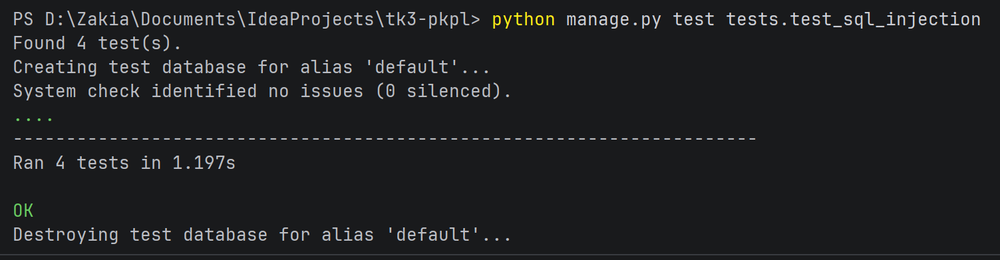

---

## B. Laporan Pentesting

### 1. Passive & Active Reconnaissance

- **Tujuan Tahapan:** Mengumpulkan informasi awal dari sudut pandang Black-box Attacker untuk memetakan seluruh port TCP terbuka, mendeteksi layanan aktif, dan melakukan pengenalan versi aplikasi atau sistem operasi.
- **Alat & Prosedur:** Menggunakan alat pemindaian jaringan Nmap v7.99 via Windows Connect mode. Perintah dijalankan melalui terminal PowerShell menuju ke alamat host lokal target: nmap -T4 -sV -p- 127.0.0.1
- **Hasil & Temuan:** Proses pemindaian mendeteksi total 19 port TCP terbuka. Berikut adalah daftar port esensial dan service banner yang berhasil ditarik:

  | PORT          | STATE | SERVICE      | VERSION                        |
  | :------------ | :---- | :----------- | :----------------------------- |
  | **135/tcp**   | open  | msrpc        | Microsoft Windows RPC          |
  | **445/tcp**   | open  | microsoft-ds | -                              |
  | **5432/tcp**  | open  | postgresql   | PostgreSQL DB                  |
  | **8000/tcp**  | open  | http         | WSGIServer 0.2 (Python 3.14.3) |
  | **63342/tcp** | open  | ssl/unknown  | -                              |

**Bukti Output Tool:**
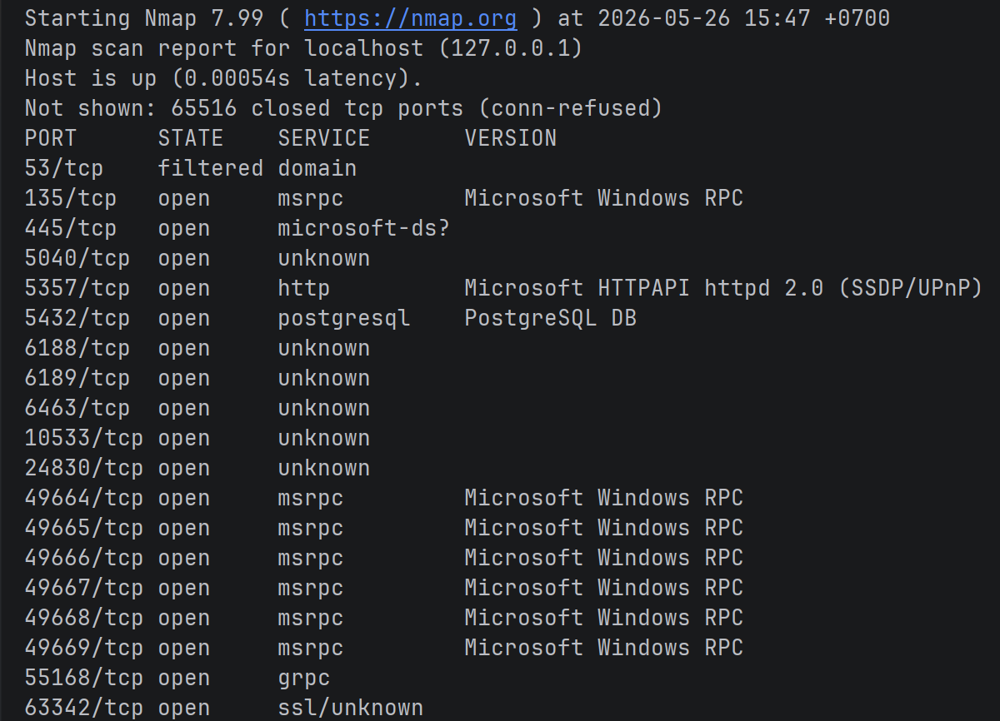
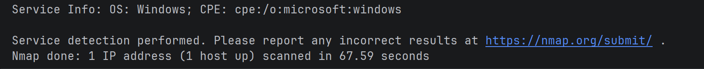

- **Analisis & Tindak Lanjut:**
  1. Aplikasi Target (Port 8000): Teridentifikasi celah Information Disclosure karena server secara transparan mengekspos versi server internal dan versi runtime. Tindak lanjutnya adalah merekomendasikan penggunaan Reverse Proxy dengan flag server_tokens off pada fase produksi demi menyamarkan HTTP Header Server.
  2. Ekspansi Attack Surface (Port 5432 & 445): Terdeteksinya port eksternal milik PostgreSQL dan Windows File Sharing membuka peluang eskalasi serangan lateral jika tidak dikunci lewat firewall sistem operasi.
  3. Tindak Lanjut Kode (settings.py): Untuk meredam potensi kebocoran data arsitektur lebih lanjut, dilakukan perbaikan pada konfigurasi flag keamanan secara dinamis. Parameter diubah menjadi DEBUG = not PRODUCTION, dan flag SESSION_COOKIE_SECURE & CSRF_COOKIE_SECURE diatur agar otomatis bernilai True secara eksklusif hanya saat aplikasi berjalan di HTTPS.

### 2. Threat Modeling

**Target Aplikasi:** Ride-Hailing Platform
**Framework:** Django (Python), SQLite
**Peran Pengguna:** Penumpang, Pengemudi, Penyedia Layanan (Admin)

**Identifikasi Aset:**

1. **Data Kredensial Pengguna**: Username, Password Hash, Session ID.
2. **Data Transaksi**: Riwayat perjalanan, titik jemput, titik tujuan, status pesanan, dan waktu pemesanan.
3. **Data Rating dan Ulasan**: Feedback dan rating performa pengemudi.
4. **Ketersediaan Sistem**: Uptime server aplikasi.

**Identifikasi Ancaman (STRIDE):**
| Jenis Ancaman | Skenario Serangan | Tingkat Risiko |
|---------------|-------------------|----------------|
| **Spoofing** | Penyerang login menggunakan kredensial orang lain (Brute Force/pencurian session). | Tinggi |
| **Tampering** | Memanipulasi parameter form (`titik_jemput`, `skor` rating) atau status pesanan. | Tinggi |
| **Repudiation** | Bantahan telah mengambil/membuat pesanan tanpa log waktu yang valid. | Sedang |
| **Information Disclosure** | SQL Injection pada pencarian riwayat atau XSS pada fitur Ulasan. | Tinggi |
| **Denial of Service (DoS)** | Membanjiri request form pemesanan hingga server down. | Sedang |
| **Elevation of Privilege** | Akses halaman "Penyedia Layanan" oleh "Penumpang" lewat Broken Access Control. | Tinggi |

**Permukaan Serangan (Attack Surface):**

1. **Endpoint Autentikasi** (`/login`, `/register`).
2. **Input Form Pemesanan dan Ulasan** (`/pesan`, `/rating`).
3. **Fitur Pencarian Riwayat Perjalanan**.
4. **URL / Dashboard berdasar Role**.

### 3. Scanning & Enumeration

- **Area Pemindaian:** Code injection, broken authentication, CSRF, dan SQL/Database Injection.
- **Tools yang Digunakan:** ...
- **Hasil Scanning Otomatis:** ...
- **Hasil Enumerasi Manual:** ...

### 4. Exploitation & Testing

- **Skenario Exploit 1 (Kerentanan X):** (Jelaskan cara exploit dilakukan, tools, dan hasilnya).
- **Skenario Exploit 2 (Kerentanan Y):** ...
- (Tambahkan sesuai jumlah kerentanan yang ditemukan)

### 5. Reporting & Remediation

- **Ringkasan Temuan (Executive Summary):** ...
- **Detail Kerentanan & Skor Risiko:** ...
- **Saran Perbaikan (Remediation):** ...

## C. Video Youtube Demo - TK 4

### **[Video Kelompok]()**
