# **Tugas 3 - Secure Coding Implementation**

**Kelompok : kelompok kami suka panen sawit**  
Anggota Kelompok:

- Nezzaluna Azzahra (2406495741)
- Hillary Elizabeth Clara Pasaribu (2406407266)
- Cristian Dillon Philbert (2406495956)
- Raihana Auni Zakia (2406495760)
- Vidia Qonita Ahmad (2406345381)

---

## 1. Deskripsi Aplikasi

### A. Skenario & Fitur Utama

- **Skenario:** Ride-Hailing Platform
- **Fitur Utama:**
  - Fitur 1: Pemesanan ojek (Request Ride)
  - Fitur 2: Rating driver (Give Rating)
  - Fitur 3: Riwayat pesanan (View Ride History)
- **Master Data & Peran Pengguna:**
  1.  **Penumpang (Passenger)**: Melakukan pemesanan, melihat riwayat perjalanan, melakukan pembayaran, dan memberikan rating.
  2.  **Pengemudi (Driver)**: Menerima pesanan (acceptRide), memulai (startTrip), dan menyelesaikan perjalanan (completeTrip).
  3.  **Penyedia Layanan (Admin)**: Mengelola pengguna (manageUsers) dan menghasilkan laporan (generateReport).

### B. Stack Teknologi

- **Framework:** Django
- **Database:** SQLite
- **Library Lain:**

---

## 2. Implementasi Secure Coding

### A. Code Injection

- **Vulnerability:**
  - Input pengguna pada field pesanan dan review dapat digunakan untuk injeksi HTML, XSS, atau template injection jika ditampilkan kembali tanpa pengamanan.
  - Risiko yang dimitigasi:
    - **CWE-79**: Improper Neutralization of Input During Web Page Generation (Cross-Site Scripting)
    - **CWE-94**: Improper Control of Generation of Code ('Code Injection')

- **Teknik Mitigasi:**
  - Django template auto-escaping tetap aktif secara global sehingga output dari `{{ }}` tidak dirender sebagai HTML/script.
  - Tidak ada penggunaan `|safe` atau `mark_safe()` pada konten pengguna.
  - Input divalidasi dengan allowlist karakter sebelum diproses atau disimpan ke database.
  - Model dan form melakukan validasi tambahan untuk field yang berisiko (`titik_jemput`, `titik_tujuan`, `ulasan`, dan `username`).

- **Perbandingan Kode:**

  | Bagian | Sebelum (Vulnerable) | Sesudah (Secure) | Penjelasan | File |
  | :--- | :--- | :--- | :--- | :--- |
  | Input pesanan | `request.POST.get('titik_jemput')` langsung dipakai ke `Pesanan.objects.create(...)` | `clean_titik_jemput()` memanggil `validate_no_injection()`, `validate_location_allowlist()`, lalu `sanitize_input()` | Mencegah HTML/skrip masuk ke data pesanan sebelum disimpan | [main/forms.py](main/forms.py), [main/models.py](main/models.py) |
  | Input review | `request.POST.get('ulasan')` langsung disimpan ke `Rating.objects.create(...)` | `clean_ulasan()` memvalidasi allowlist lalu men-sanitize teks review | Menutup stored XSS dan HTML injection pada field ulasan | [main/forms.py](main/forms.py), [main/models.py](main/models.py) |
  | Template output | `{{ rating.ulasan\|safe }}` dapat memaksa HTML dirender | `{{ rating.ulasan }}` dibiarkan memakai auto-escaping Django | Output pengguna tetap tampil sebagai teks, bukan HTML/script | [main/templates/main/rating_review.html](main/templates/main/rating_review.html), [main/templates/main/rating_saya.html](main/templates/main/rating_saya.html) |
  | Validasi username | Username dapat masuk tanpa allowlist yang ketat | `clean_username()` memanggil `validate_username_allowlist()` | Mengurangi risiko payload injeksi pada identitas akun | [main/forms.py](main/forms.py), [main/models.py](main/models.py) |
  | Validasi & sanitasi | Tidak ada module khusus untuk validasi/sanitasi input | Module `sanitizers.py` dengan fungsi: `validate_no_injection()`, `validate_location_allowlist()`, `validate_review_allowlist()`, `validate_username_allowlist()`, `sanitize_input()` | Menyediakan fungsi reusable untuk blok pattern injeksi (script, event handler, template) dan enforce allowlist karakter per field | [main/sanitizers.py](main/sanitizers.py) |

### B. Broken Authentication

- **Vulnerability:**
- **Teknik Mitigasi:**
- **Perbandingan Kode:**
  | Sebelum (Vulnerable) | Sesudah (Secure) |
  | :--- | :--- |
  | | |

### C. CSRF (Cross-Site Request Forgery)

- **Vulnerability:**  
  Tanpa perlindungan CSRF, penyerang dapat memaksa pengguna yang sudah login untuk mengirimkan request berbahaya (misalnya memesan ojek, mengirim rating, atau mengubah data) melalui situs eksternal atau email.  
  **CWE-352: Cross-Site Request Forgery (CSRF)**

- **Teknik Mitigasi:**  
  - Semua form dengan metode `POST` (login, register, pesan ojek, rating) wajib menyertakan token CSRF menggunakan `` di template.  
  - Middleware `CsrfViewMiddleware` tetap aktif (default Django) untuk memverifikasi setiap request POST/PUT/DELETE.  
  - Tidak ada satupun view yang diberi dekorator `@csrf_exempt`.  
  - Untuk request AJAX, token diambil dari cookie `csrftoken` dan dikirim melalui header `X-CSRFToken`.  
  - Konfigurasi CORS dibiarkan default sehingga request dari origin `null` (file lokal) atau domain tidak dikenal ditolak.

- **Perbandingan Kode:**  

  | Sebelum (Vulnerable) | Sesudah (Secure) | File |
  | :--- | :--- | :--- |
  | <form method="POST" action="/pesan/"><br>    <input name="titik_jemput"><br>    <input name="titik_tujuan"><br>    <button type="submit">Pesan</button><br></form> | <form method="POST" action="/pesan/"><br>    ****<br>    <input name="titik_jemput"><br>    <input name="titik_tujuan"><br>    <button type="submit">Pesan</button><br></form> | `main/templates/main/pesan_ojek.html` |
  | <form method="POST" action="/rating/"><br>    <input name="ulasan"><br>    <button type="submit">Kirim</button><br></form> | <form method="POST" action="/rating/"><br>    ****<br>    <input name="ulasan"><br>    <button type="submit">Kirim</button><br></form> | `main/templates/main/rating_review.html` |
  | Tidak ada token di form login/register | Login & register juga menggunakan `` | `main/templates/main/login.html`, `register.html` |

  **Penjelasan:**  
  Django menghasilkan token unik per session yang disisipkan sebagai hidden input. Middleware `CsrfViewMiddleware` memverifikasi kecocokan token sebelum memproses request. Jika token tidak ada, salah, atau tidak dikirim, server mengembalikan **HTTP 403 Forbidden**.

### D. SQL/Database Injection

- **Vulnerability:** 
  - Input pengguna pada fitur autentikasi dan kotak pencarian riwayat dapat dieksekusi sebagai perintah SQL aktif jika digabungkan secara langsung menggunakan raw string concatenation, memungkinkan penyerang melewati autentikasi atau mengekstrak data dari tabel lain
  - Risiko yang dimitigasi:
    - CWE-89: Improper Neutralization of Special Elements used in an SQL Command


- **Teknik Mitigasi:**
  - Seluruh interaksi database pada endpoint login sama sekali tidak menggunakan eksekusi string SQL mentah, melainkan menggunakan fungsi autentikasi bawaan Django yang secara otomatis menjalankan parameterized query
  - Seluruh query pada fitur filter dan pencarian riwayat dikelola menggunakan `Model.objects.filter()` untuk menjamin binding parameter sehingga input terpisah secara ketat dari perintah eksekusi SQL
  - Input pencarian divalidasi dengan allowlist karakter menggunakan Regular Expression sebelum diproses ke dalam query ORM
  - Prinsip least privilege diimplementasikan pada File Permissions untuk membatasi akses baca/tulis terhadap file `db.sqlite3` hanya kepada service account web server yang membutuhkan

- **Perbandingan Kode:**

| Bagian | Sebelum (Vulnerable) | Sesudah (Secure) | Penjelasan | File |
| :--- | :--- | :--- | :--- | :--- |
| Autentikasi Login | Input `username` dan `password` dirangkai paksa menggunakan f-string ke dalam eksekusi `cursor.execute()`. | Mendelegasikan validasi ke fungsi `authenticate()` bawaan Django yang otomatis menerapkan parameterized query. | Mencegah Login Bypass seperti `' OR '1'='1` karena input berbahaya akan dikunci sebagai nilai literal biasa. | `main/views.py` |
| Pencarian Riwayat | Parameter `q` langsung disisipkan ke dalam raw query menggunakan perintah eksekusi `LIKE '%{search_query}%'`. | Parameter diuji menggunakan validasi regex allowlist, kemudian dieksekusi murni melalui fungsionalitas Django ORM `.filter()` dan objek `Q`. | Menutup celah eksploitasi Data Extraction secara berlapis dengan blokir karakter di backend dan perlindungan parameter ORM. | `main/views.py` |
| Izin Akses Database | Konfigurasi database tidak dikunci, file `db.sqlite3` dapat diakses dan dibaca oleh pengguna sistem operasi secara luas. | Akses read/write pada sistem operasi dibatasi secara ketat khusus untuk eksekutor aplikasi. | Memenuhi prinsip Least Privilege untuk skenario file-based database tanpa user management internal DBMS. | Server Config |

---

## 3. Screenshot Aplikasi

1.  **Halaman Login & Dashboard**
2.  **Fitur Utama (Sesuai Skenario)**
3.  **Bukti Security (Misal: Error rate limiting/CSRF)**

### CSRF Protection

| Screenshot | Deskripsi | TC Terkait |
| :--- | :--- | :--- |
| 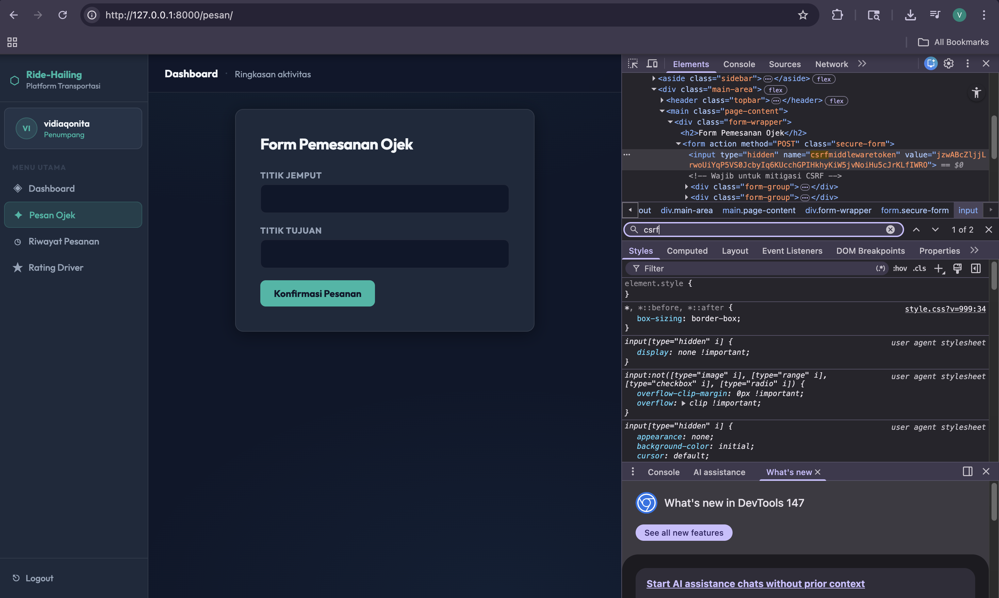 | Token CSRF terlihat di form pemesanan ojek (`/pesan/`) | TC-CSRF-01, TC-CSRF-04g |
| 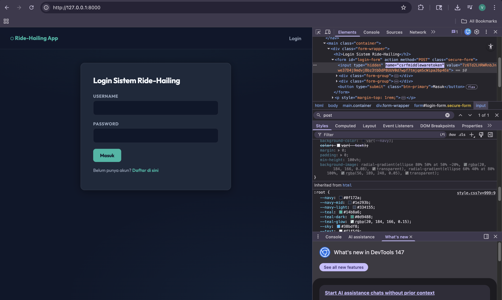 | Token CSRF di form login (`/login/`) | TC-CSRF-01 |
| 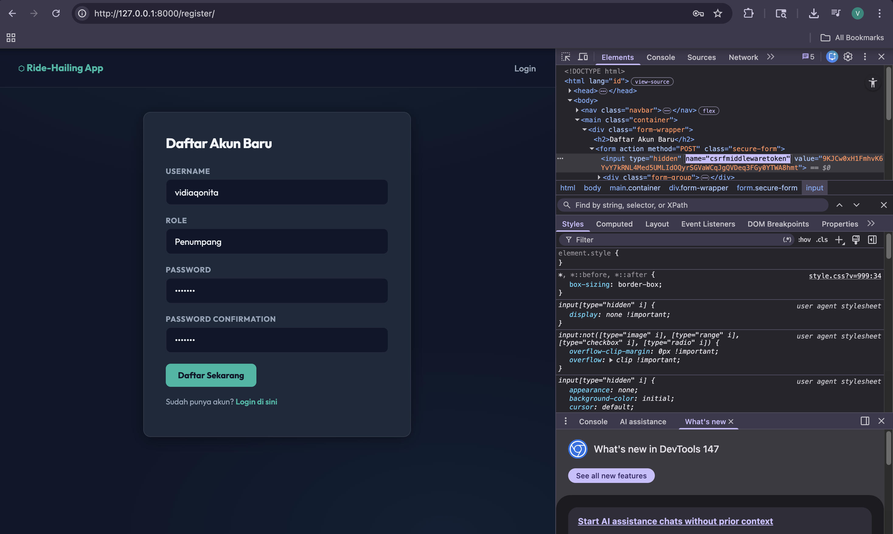 | Token CSRF di form register (`/register/`) | TC-CSRF-01 |
| 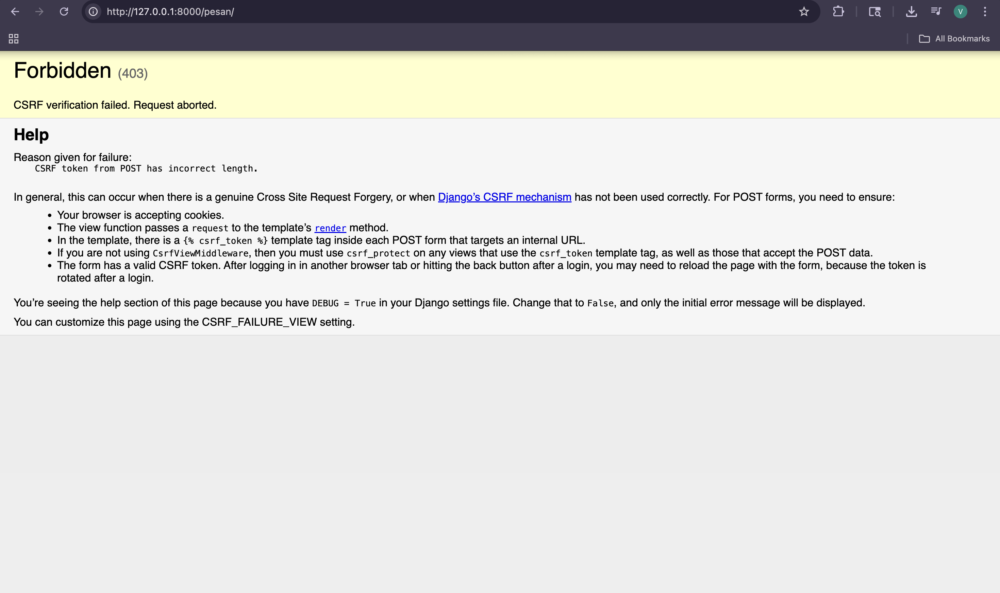 | Setelah token diubah menjadi `invalid_token_12345`, server menolak dengan 403 | TC-CSRF-02 |
| 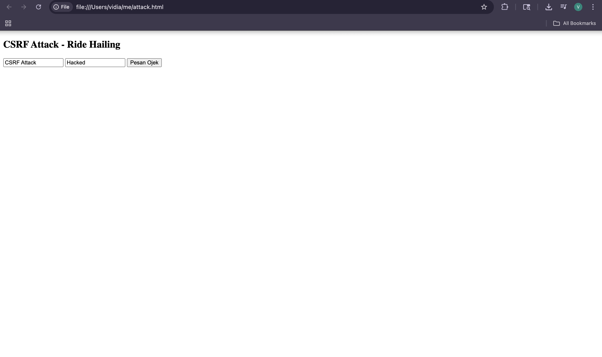 | File `attack.html` yang mencoba mengirim POST ke `/pesan/` tanpa token | TC-CSRF-03, TC-CSRF-04g |
| 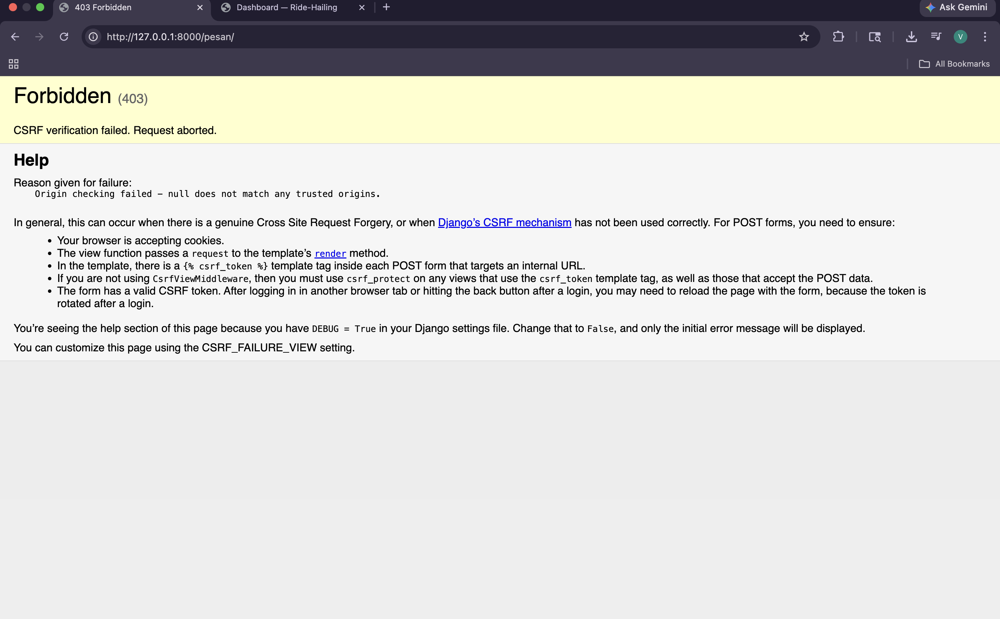 | Request dari origin `null` ditolak karena CSRF token tidak valid | TC-CSRF-03, TC-CSRF-04g |

---

## 4. Hasil Test-Case

- **TC-SQLi-01** (Login Bypass via SQL Injection): [Status PASS] Sistem berhasil menolak payload serangan dan meresponsnya secara normal dengan pesan error bahwa kredensial salah. Fungsi authenticate bawaan terbukti efektif mengamankan endpoint dari upaya login bypass secara paksa.
  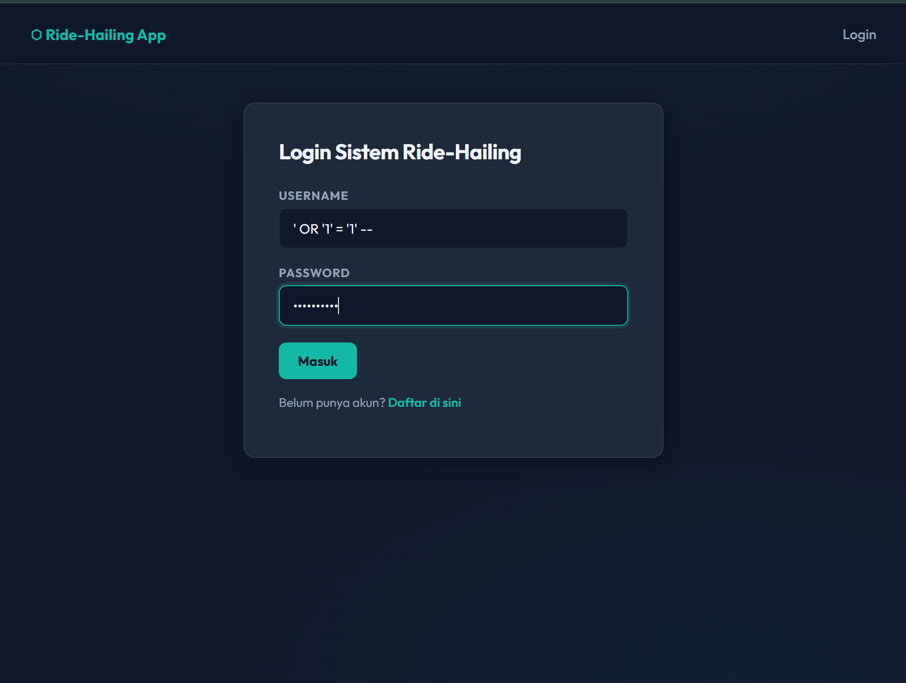
  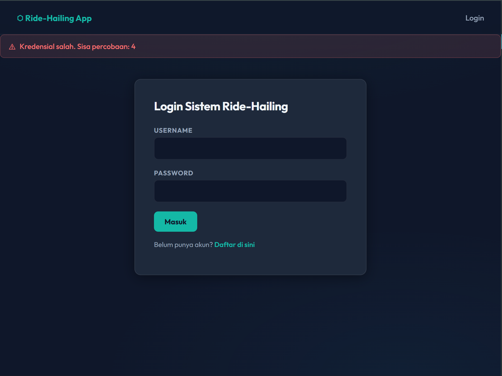

- **TC-SQLi-02** (Data Extraction via Search Input): [Status PASS] Upaya penyisipan payload UNION SELECT berhasil digagalkan oleh regex dan ORM. Aplikasi tetap mengembalikan hasil pencarian secara normal atau kosong tanpa membocorkan isi data dari tabel users serta tidak menampilkan stack trace sama sekali.
  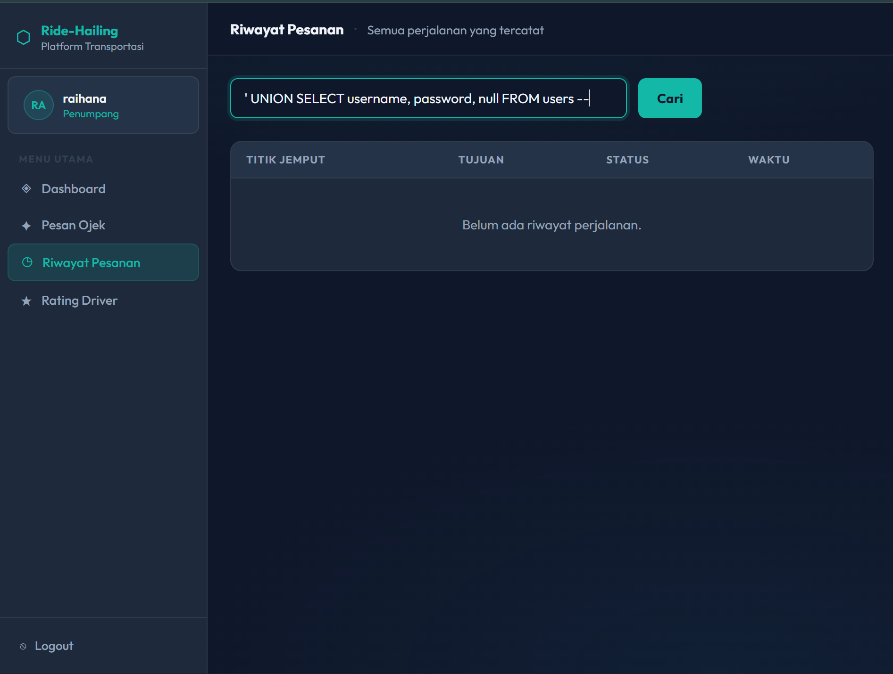
  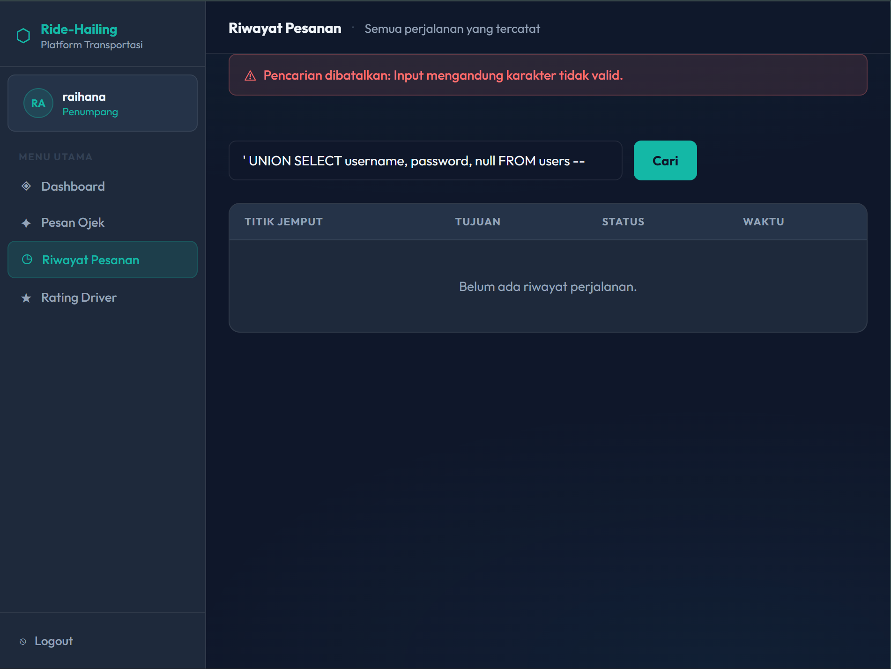

- **TC-SQLi-03** (Parameterized Query Verification): [Status PASS] Hasil code review memverifikasi bahwa tidak ada satu pun raw string concatenation yang berasal dari input user. Seluruh fungsi telah sepenuhnya diimplementasikan menggunakan Django ORM dan parameterized query untuk menjamin keamanan.
  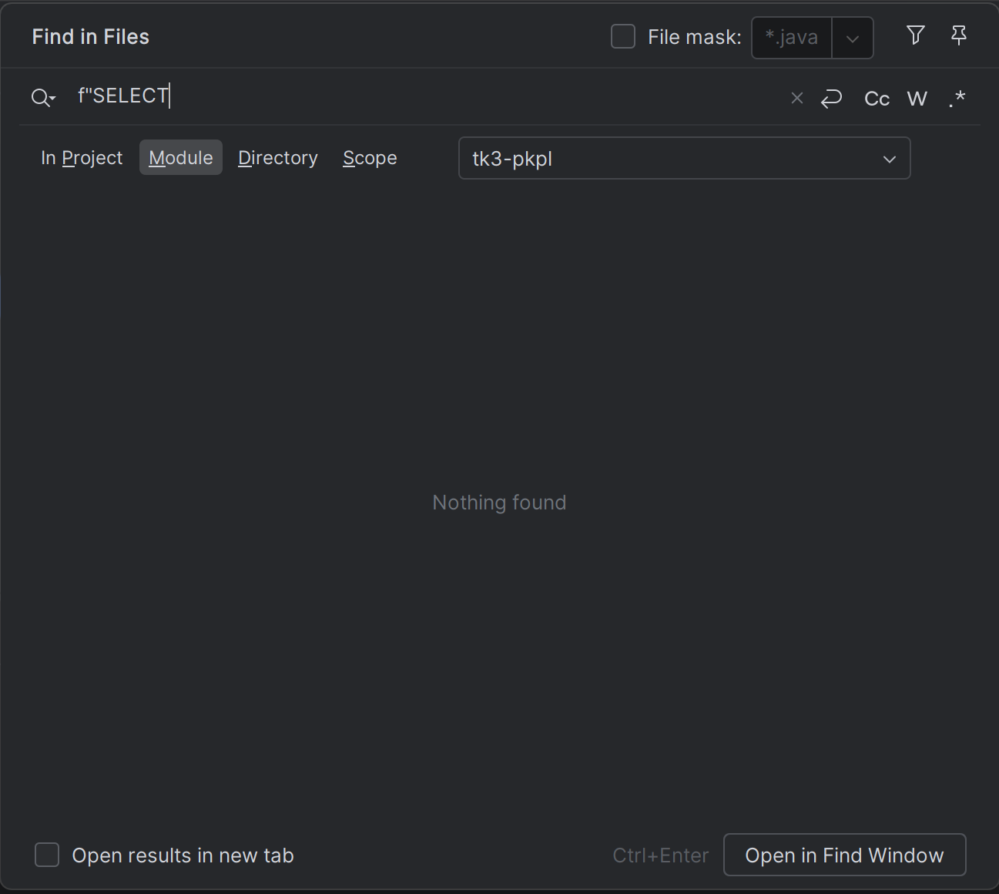

- **TC-SQLi-04g** (Ride Hailing: Pencarian Riwayat Perjalanan): [Status PASS] Payload manipulasi logika seperti 5 OR 1=1 berhasil ditangani dengan baik. Aplikasi tetap mengisolasi data secara ketat dengan hanya menampilkan riwayat pesanan milik user yang sedang login sehingga sukses mencegah kebocoran privasi data milik user lain.
  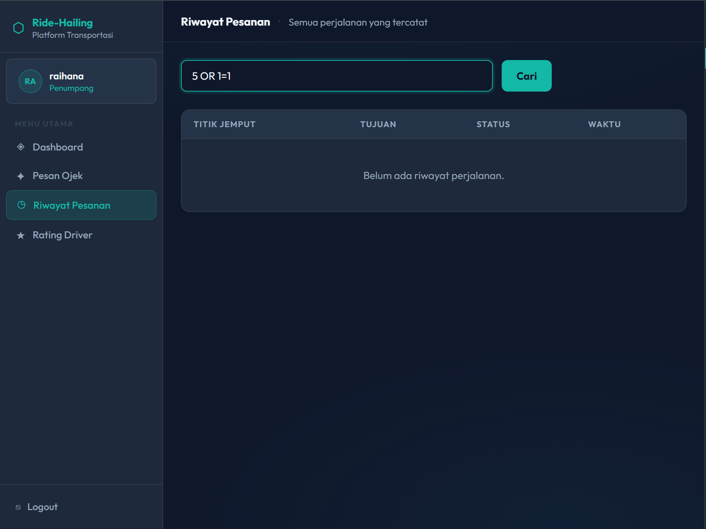
  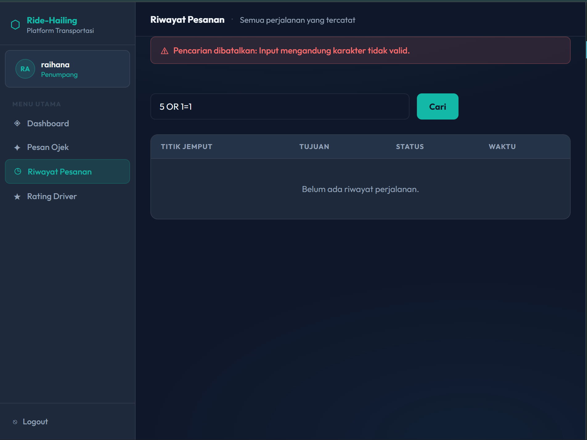

### CSRF Test Cases

| TC-ID | Nama TC | Hasil | Bukti |
| :--- | :--- | :--- | :--- |
| **TC-CSRF-01** | CSRF Token Presence on Forms | ✅ **Lolos** | Semua form POST (login, register, pesan ojek, rating) memiliki ``. Lihat screenshot `csrf-token-pesan-ojek.png`, `csrf-token-login.png`, `csrf-token-register.png`. |
| **TC-CSRF-02** | Request dengan CSRF Token Invalid Ditolak | ✅ **Lolos** | Setelah mengubah nilai token menjadi `invalid_token_12345`, server mengembalikan HTTP 403. Lihat `csrf-invalid-token-403.png`. |
| **TC-CSRF-03** | Simulasi Cross-Origin Request (Tanpa Token) | ✅ **Lolos** | File `attack.html` dari origin `null` ditolak dengan 403. Lihat `csrf-cross-origin-403.png`. |
| **TC-CSRF-04g** | Form Pemesanan Ojek (Ride-Hailing) | ✅ **Lolos** | Endpoint `/pesan/` dilindungi CSRF; percobaan serangan dari luar gagal (sama dengan TC-CSRF-03). Lihat bukti yang sama. |

> **Kesimpulan:** Seluruh 4 test case CSRF (3 general + 1 spesifik Ride‑Hailing) **lolos**. Aplikasi tidak rentan terhadap serangan CSRF.

---

## 5. Petunjuk Instalasi

```bash
# 1. Clone Repositori
git clone https://gitlab.cs.ui.ac.id/pkpl26/49-kelompok-kami-suka-panen-sawit/tk3-pkpl.git

# 2. Setup Environment
python -m venv venv
source venv/bin/activate  # Unix/macOS
venv\Scripts\activate  # Windows

# 3. Install Dependencies
pip install -r requirements.txt

# 4. Database Migration
python manage.py migrate

# 5. Implementasi Least Privilege
chmod 600 db.sqlite3

# 6. Jalankan Aplikasi
python manage.py runserver
```
